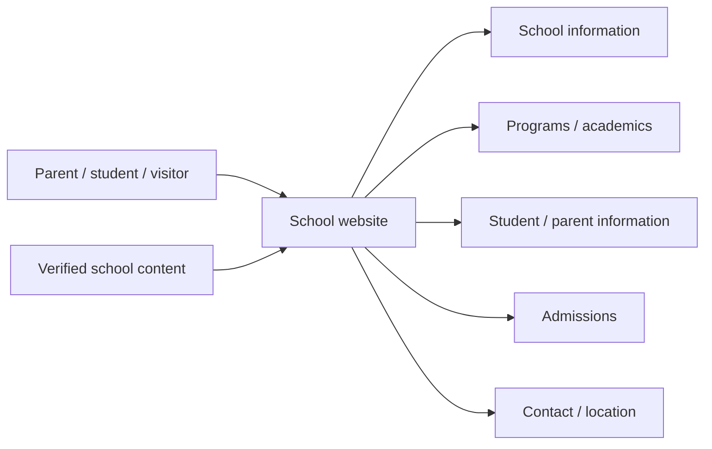
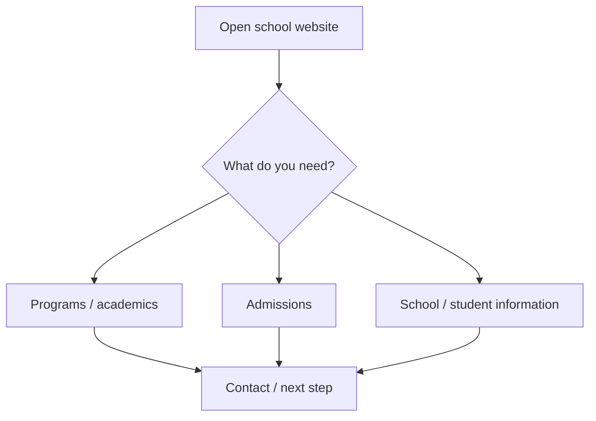
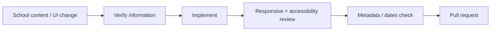

<div align="center">

# Siddhartha Vanasthali School

**A school website project for presenting Siddhartha Vanasthali School information, programs, student/parent resources, admissions context, and contact paths.**


[Browse source](https://github.com/Nischhalsubba/Siddhartha-Vanasthali-School/tree/master) · [Issues](https://github.com/Nischhalsubba/Siddhartha-Vanasthali-School/issues)

</div>

## Overview

This repository is documented as a school-information experience. Parents, students, staff, designers, and developers should all be able to understand the site without translating between technical architecture and institutional language.

<details open>
<summary><strong>🏗️ Interactive school-site architecture</strong></summary>



</details>

## Visitor flow



## Audience guide

| Audience | Focus |
|---|---|
| Parents / students | Academics, admissions, notices, location and contact |
| School staff | Accurate dates, programs, policies and contact information |
| Developers | Page structure, assets, interactions and delivery |
| Designers | Information hierarchy, trust, responsive use and accessibility |

## Getting started

```bash
git clone https://github.com/Nischhalsubba/Siddhartha-Vanasthali-School.git
cd Siddhartha-Vanasthali-School
```

Use the repository project files to determine the current runtime and development commands.

## Design & accessibility

School information must be readable on phones, keyboard-accessible, clearly dated when time-sensitive, and available as text rather than only images/PDF posters. Use meaningful link labels, alt text, focus states and clear admissions/contact CTAs.

## SEO & discoverability

Use the verified school name, location and real academic/admissions terminology in titles, descriptions and visible text. Maintain semantic headings, canonical URLs, School/Organization structured data, accessible images, sitemap/robots configuration where appropriate, and social-preview metadata. Do not invent rankings, results, awards or admissions claims.

## Contribution flow


