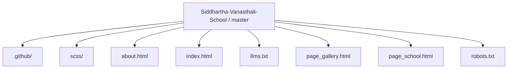
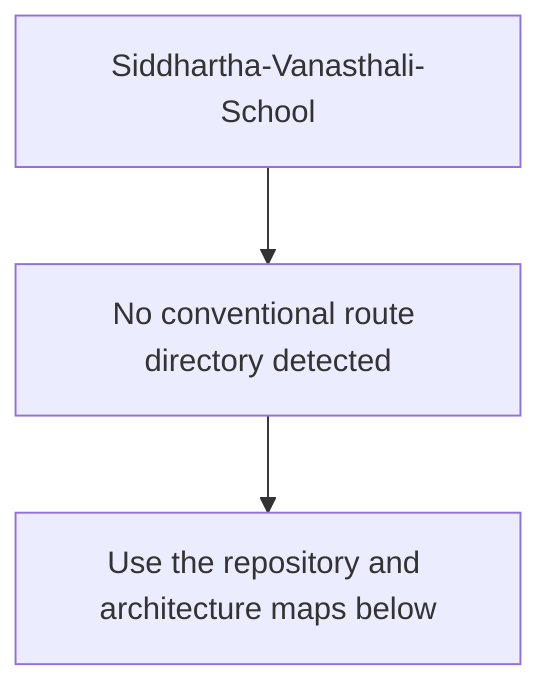
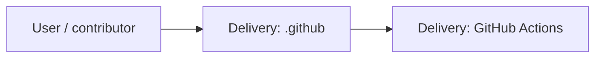
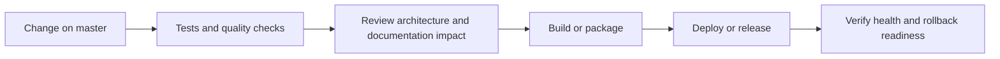
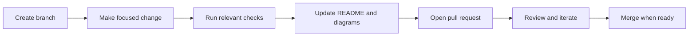

<!-- interactive-readme-standard:start -->

<div align="center">

# Siddhartha-Vanasthali-School

**Branch-aware technical guide for [`master`](https://github.com/Nischhalsubba/Siddhartha-Vanasthali-School/tree/master)**

<p>   </p>

<p>
  <a href="https://github.com/Nischhalsubba/Siddhartha-Vanasthali-School/tree/master"><strong>Browse source</strong></a> ·
  <a href="https://github.com/Nischhalsubba/Siddhartha-Vanasthali-School/issues"><strong>Issues</strong></a> ·
  <a href="https://github.com/Nischhalsubba/Siddhartha-Vanasthali-School/codespaces/new?ref=master"><strong>Open in Codespaces</strong></a>
</p>

</div>

> [!IMPORTANT]
> This guide is generated from the files actually present on `master`. It links to detected source paths, preserves project-authored notes, and avoids claiming components that were not found.

## At a glance

| Item | Detected value |
|---|---|
| Purpose | A Sass project documented from the current branch structure and manifests. |
| Branch role | Default branch |
| Stack | Sass, HTML |
| Manifests | No standard manifest detected |
| Prerequisites | Confirm from the detected manifests |
| Delivery | GitHub Actions |
| License | No license file detected |

## Branch scope

This is the repository's default branch.


## Quick start

> No reliable setup command was detected. Use the preserved project-authored notes and manifests rather than guessing.

### Configuration surface

- No committed environment example file was detected.

> Never commit secrets, private keys, production credentials, customer data, or unredacted infrastructure details.

## Repository map



| Responsibility | Detected source paths |
|---|---|
| Delivery | [`.github`](https://github.com/Nischhalsubba/Siddhartha-Vanasthali-School/tree/master/.github) |

## Website or application map



## Architecture and responsibility flow




## Quality, security, and operations

<table>
<tr>
<td width="33%" valign="top">

### Quality

- No conventional test directory was detected automatically.

Detected commands:
- No standard quality command detected.

</td>
<td width="33%" valign="top">

### Security

- No dedicated security policy or automated dependency configuration was detected.

Review authentication, authorization, input validation, dependency updates, secret handling, and failure recovery before release.

</td>
<td width="34%" valign="top">

### Observability

- No dedicated observability integration was detected automatically.

Define useful logs, metrics, traces, alerts, and rollback signals for production-facing branches.

</td>
</tr>
</table>

## Delivery flow



### Automation detected

- [`.github/workflows/apply-interactive-readme.yml`](https://github.com/Nischhalsubba/Siddhartha-Vanasthali-School/blob/master/.github/workflows/apply-interactive-readme.yml)

## Contribution flow



- Keep changes focused and explain architectural consequences.
- Run the checks relevant to the changed area.
- Update diagrams whenever routes, modules, data models, authentication, jobs, or delivery paths change.
- Add screenshots or recordings for visual behavior changes when useful.
- Use issues for reproducible defects and pull requests for reviewable changes.

## Ownership and support

| Topic | Source |
|---|---|
| Repository | [`Nischhalsubba/Siddhartha-Vanasthali-School`](https://github.com/Nischhalsubba/Siddhartha-Vanasthali-School) |
| Branch | [`master`](https://github.com/Nischhalsubba/Siddhartha-Vanasthali-School/tree/master) |
| Ownership | No CODEOWNERS file detected |
| Contributing | Use the contribution flow above |
| Support | [Open or review issues](https://github.com/Nischhalsubba/Siddhartha-Vanasthali-School/issues) |
| License | No license file detected |

<details>
<summary><strong>Documentation maintenance checklist</strong></summary>

- [ ] Purpose and branch scope are accurate.
- [ ] Setup and configuration commands still work.
- [ ] Repository, application, API, data, authentication, job, and deployment diagrams match the code.
- [ ] Tests, security controls, observability, and rollback behavior are documented.
- [ ] Links point to real files on this branch.
- [ ] No secrets or private operational details are exposed.

</details>

<!-- interactive-readme-standard:end -->

<!-- project-authored-notes:start -->
<details>
<summary><strong>Project-authored notes preserved from this branch</strong></summary>

<div align="center">


# Siddhartha Vanasthali School

### Lightweight School Website Redesign

**A modern, responsive school website redesign for Siddhartha Vanasthali School in Kathmandu, Nepal — focused on readability, lightweight frontend performance, WordPress customization direction, modular SCSS, ES6 JavaScript, Gulp workflow automation, carousel UI, and scroll animations.**


</div>

---

## ✨ Overview

**Siddhartha Vanasthali School** is a private institute in Kathmandu, Nepal. This repository contains a redesigned version of the school website with a modern layout, improved readability, responsive structure, and a future direction toward a dynamic WordPress implementation.

The original goal was to improve the school’s old static website and move it toward a more flexible, customizable experience.

**Demo:**  
`https://nischhalsubba.github.io/Siddhartha-Vanasthali-School/`

---

## 🧭 Table of Contents

- [Project Goals](#-project-goals)
- [Designer’s Perspective](#-designers-perspective)
- [What Changed](#-what-changed)
- [Technology Used](#-technology-used)
- [Key Features](#-key-features)
- [WordPress Direction](#-wordpress-direction)
- [Quality Checklist](#-quality-checklist)
- [Roadmap](#-roadmap)
- [License](#-license)

---

## 🎯 Project Goals

The redesign was focused on:

- improving readability
- making the layout feel more modern
- keeping the website lightweight
- improving responsive behavior
- avoiding unnecessary heavy frameworks
- preparing the structure for future WordPress conversion
- making content easier for the client to manage later

---

## 🎨 Designer’s Perspective

A school website should feel credible, clear, and easy for parents, students, and staff to navigate.

Important UX priorities:

- clear school identity
- readable content hierarchy
- strong homepage sections
- accessible navigation
- mobile-friendly layout
- lightweight loading experience
- easy future content editing

This project reflects an early but thoughtful design-to-code process: visual redesign first, frontend implementation next, and WordPress customization as the future target.

---

## 🔁 What Changed

Previous website:

```text
http://www.svi.edu.np/
```

Redesign improvements:

- implemented a modern layout with higher readability
- moved toward converting the static website into a dynamic WordPress website
- created a lighter frontend structure
- used modular SCSS for easier future updates
- avoided relying on heavy design frameworks

---

## 🛠 Technology Used

| Tool | Purpose |
|---|---|
| Gulp | Workflow automation |
| SCSS | Modular and maintainable styling |
| ES6 JavaScript | Modern interaction logic |
| Glide.js | Carousel/slider interaction |
| Scroll-Out.js | Scroll-based animation |
| GitHub Pages | Static demo deployment |

---

## 🌟 Key Features

| Feature | Description |
|---|---|
| Lightweight CSS | Main CSS file was kept under 25KB directionally |
| Responsive layout | Designed to work across device sizes |
| No heavy UI framework | Layout does not depend on Bootstrap or similar frameworks |
| ES6-based scripts | Avoids jQuery dependency direction |
| Carousel support | Glide.js used for website carousel behavior |
| Scroll animation | Scroll-Out.js used for reveal-style motion |
| WordPress-ready thinking | Future plan to make the site customizable through WordPress frontend customizer |

---

## 🧩 WordPress Direction

The future WordPress implementation goal was to make the website highly customizable through the WordPress Customizer, so the client would not need to rely heavily on backend editing.

Ideal WordPress goals:

- editable homepage sections
- customizable colors and typography
- editable carousel content
- editable notices/news/events
- frontend-friendly customization
- simple admin experience for school staff

---

## ✅ Quality Checklist

### Design QA

- [ ] Homepage hierarchy is clear.
- [ ] School identity is visible.
- [ ] Mobile layout is readable.
- [ ] Carousel content is easy to scan.
- [ ] Animation does not distract from content.
- [ ] Parent/student CTAs are clear.

### Technical QA

- [ ] Gulp workflow runs.
- [ ] SCSS compiles correctly.
- [ ] ES6 scripts work.
- [ ] Glide.js carousel works.
- [ ] Scroll-Out animations initialize.
- [ ] Main CSS remains lightweight.
- [ ] Demo deploy works on GitHub Pages.

---

## 🗺 Roadmap

- Convert static frontend into a WordPress theme.
- Add Customizer controls for homepage content.
- Add news/events management.
- Add school gallery management.
- Add SEO metadata.
- Add accessibility audit.
- Add performance audit.
- Replace any outdated links/content.

---

## 📜 License

This project is licensed under the [MIT License](https://choosealicense.com/licenses/mit/).

---

<div align="center">

A lightweight school website redesign focused on readability, performance, and future WordPress customization.

</div>

</details>
<!-- project-authored-notes:end -->
